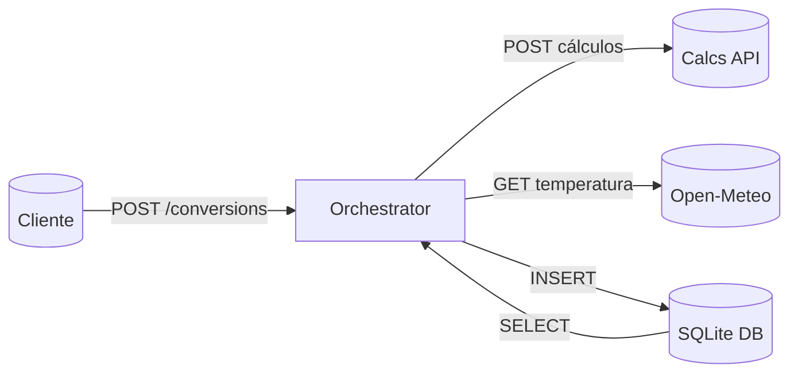

# EngLab Orchestrator API

Esta API funciona como componente principal (API principal) da arquitetura proposta neste MVP
Microserviço principal responsável por **orquestrar cálculos**, integrar dados de clima em tempo real e persistir o histórico das operações.  
Demonstra arquitetura baseada em componentes desacoplados e comunicação entre microsserviços.

---

## 📌 Arquitetura

A Orchestrator API implementa:

- Comunicação direta com a **EngLab Calcs API**
- Consumo da **API externa Open-Meteo**
- Persistência com **SQLite**
- CRUD completo
- Validação via Pydantic
- Projeto modular e escalável 

---

## 🧩 Fluxo da Orquestração

1. Cliente envia requisição para `/conversions`  
2. Payload é validado  
3. Orchestrator chama a **Calcs API**  
4. API externa Open-Meteo fornece temperatura atual  
5. Dados são agregados  
6. Registro é salvo no SQLite  
7. Resposta completa é retornada ao cliente  

---

## 📁 Estrutura de diretórios

```
MVP-englab-orchestrator-api/
├── app/
│   ├── main.py
│   ├── db.py
│   ├── models.py
│   ├── schemas.py
│   ├── routers/
│   │   ├── __init__.py
│   │   ├── conversions.py
│   │   └── health.py
│   └── __init__.py
├── .dockerignore
├── .gitattributes
├── .gitignore
├── Dockerfile
├── README.md
└── requirements.txt
```

---

## 🚀 Como rodar localmente (sem Docker)

> Testado com **Python 3.11**.  
> A Calcs API deve estar rodando em **http://127.0.0.1:8000**

### 1️⃣ Criar ambiente virtual

```bash
python -m venv venv
venv\Scripts\activate
```

### 2️⃣ Instalar dependências

```bash
pip install -r requirements.txt
```

### 3️⃣ Executar servidor

```bash
uvicorn app.main:app --reload --port 8001
```

Swagger UI:  
👉 http://127.0.0.1:8001/docs

---

## 📡 Subindo a Calcs API (obrigatório)

A Orchestrator depende da Calcs API.

### Via Uvicorn:

```bash
uvicorn app.main:app --reload --port 8000
```

### Ou via Docker:

```bash
docker run --rm -p 8000:8000 englab-calcs-api
```

---

## 🐳 Docker — Orchestrator API

### Build

```bash
docker build -t englab-orchestrator-api .
```

### Run (apontando para a Calcs API local)

Windows / Mac / Linux:

```bash
docker run --rm -p 8001:8001   -e CALCS_API_URL=http://host.docker.internal:8000   englab-orchestrator-api
```

Acesse Swagger:  
👉 **http://127.0.0.1:8001/docs**


### 🗄️ Persistência do SQLite (recomendado para avaliação)

Por padrão, sem volume montado, o arquivo SQLite é criado dentro do container.
Para garantir persistência entre reinicializações do container (e facilitar validação), monte o arquivo `conversions.db` no host:

Windows (PowerShell):

```powershell
ni conversions.db -ItemType File -Force

docker run --rm -p 8001:8001 `
  -e CALCS_API_URL=http://host.docker.internal:8000 `
  -v "${PWD}\conversions.db:/app/conversions.db" `
  englab-orchestrator-api
```

---

## 🧪 Endpoints principais + exemplos práticos

### 1️⃣ POST /conversions — Criar conversão
> Cria um novo registro de conversão, orquestrando cálculo + clima + persistência.  

> **Body para colar no Swagger (Exemplo: corrente trifásica):**

```bash
{
  "calc_type": "three_phase_current",
  "input_payload": {
    "power_kw": 50,
    "voltage_v": 440,
    "power_factor": 0.85},
  "description": "Cálculo de corrente trifásica via Orchestrator"
}
```
> **Exemplo de resposta esperada:**

```bash
{
  "id": 1,
  "calc_type": "three_phase_current",
  "input_payload": {
    "power_kw": 50,
    "voltage_v": 440,
    "power_factor": 0.85
  },
  "result_payload": {
  "current_a": 76.97},
  "temperature_c": 28.4,
  "description": "Cálculo de corrente trifásica via Orchestrator",
  "created_at": "2025-12-07T14:22:01.123456"}
```
### 2️⃣ GET /conversions — Listar conversões

> Retorna a lista de todas as conversões já realizadas e salvas no banco.

> Exemplo de resposta:

```bash
[
  {
    "id": 1,
    "calc_type": "three_phase_current",
    "input_payload": {
      "power_kw": 50,
      "voltage_v": 440,
      "power_factor": 0.85
    },
    "result_payload": {
      "current_a": 76.97
    },
    "temperature_c": 28.4,
    "description": "Cálculo de corrente trifásica via Orchestrator",
    "created_at": "2025-12-07T14:22:01.123456"
  }
]
```

### 3️⃣ GET /conversions/{id} — Buscar conversão por ID

> Busca um único registro baseado no seu id (por exemplo, 1).

> **Exemplo de chamada:**

```bash
GET /conversions/1
```

>**Resposta esperada:**

```bash
{
  "id": 1,
  "calc_type": "three_phase_current",
  "input_payload": {
    "power_kw": 50,
    "voltage_v": 440,
    "power_factor": 0.85
  },
  "result_payload": {
    "current_a": 76.97},
  "temperature_c": 28.4,
  "description": "Cálculo de corrente trifásica via Orchestrator",
  "created_at": "2025-12-07T14:22:01.123456"}
```

### 4️⃣ PUT /conversions/{id} — Atualizar descrição

> Atualiza apenas o campo description de um registro existente.

> Body para colar no Swagger:

```bash
{
  "description": "Novo texto de descrição"
}
```
> Resposta esperada:

```bash
{
  "id": 1,
  "calc_type": "three_phase_current",
  "input_payload": {
    "power_kw": 50,
    "voltage_v": 440,
    "power_factor": 0.85
  },
  "result_payload": {
    "current_a": 76.97},
  "temperature_c": 28.4,
  "description": "Novo texto de descrição",   #conforme texto escolhido
  "created_at": "2025-12-07T14:22:01.123456"}
```
### 5️⃣ DELETE /conversions/{id} — Remover conversão

> Remove um registro já armazenado no banco.

>Remove um registro já armazenado no banco.

```bash
DELETE /conversions/1
```

> Resposta esperada:

```bash
{
  "detail": "Conversão removida com sucesso"
}
```

---

## 🌤️ API Externa

Usa a **Open-Meteo** para obter temperatura atual do Rio de Janeiro, sem necessidade de chave.

### 🌤️ API Externa — Open-Meteo

Esta aplicação consome a API pública **Open-Meteo** para obter a temperatura atual de referência em Rio de Janeiro.

- **Nome:** Open-Meteo Weather API  
- **Documentação oficial:** https://open-meteo.com/  
- **Autenticação:** não requer chave de API (uso gratuito).  
- **Rota utilizada (exemplo):**  
  `GET https://api.open-meteo.com/v1/forecast?latitude=-22.90&longitude=-43.20&current_weather=true`
- **Uso na aplicação:** a resposta JSON é consumida diretamente pelo Orchestrator, que extrai a temperatura (`temperature_c`) e agrega esse dado na resposta da rota `POST /conversions`, sem redirecionar o usuário para outros sistemas.

---

## 🔷 Diagrama da Arquitetura



---

## 🎯 Objetivo acadêmico

Demonstrar:
- Arquitetura de microsserviços  
- Integração entre serviços independentes  
- Consumo de API externa  
- Persistência e CRUD  
- Organização modular e clara  
