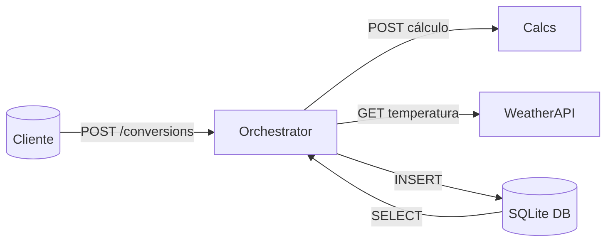

# EngLab Orchestrator API

Microserviço principal responsável por **orquestrar cálculos**, integrar API externa de clima e persistir histórico de conversões.  
Demonstra arquitetura baseada em componentes desacoplados.

---

## 📌 Arquitetura

A Orchestrator API implementa:

- Comunicação com a **Calcs API**  
- Consumo da **API Open-Meteo**  
- **CRUD completo** com SQLite  
- FastAPI com módulos claros  
- Agregação de dados e orquestração  

---

## 🧩 Fluxo da Orquestração

1. Cliente envia requisição para `/conversions`  
2. Orchestrator valida payload  
3. Chama a **Calcs API**  
4. Consulta **API de clima**  
5. Consolida dados  
6. Salva no SQLite  
7. Retorna resultado completo  

---

## 📁 Estrutura de diretórios

```
MVP-englab-orchestrator-api/
├── app/
│   ├── main.py
│   ├── db.py
│   ├── models.py
│   ├── schemas.py
│   ├── routers/
│   │   ├── __init__.py
│   │   ├── conversions.py
│   │   └── health.py
│   └── __init__.py
├── .dockerignore
├── .gitattributes
├── .gitignore
├── Dockerfile
├── README.md
└── requirements.txt
```

---

## 🚀 Como rodar localmente

### 1. Criar ambiente virtual

```bash
python -m venv venv
./venv/Scripts/activate
```

### 2. Instalar dependências

```bash
pip install -r requirements.txt
```

### 3. Rodar servidor

```bash
uvicorn app.main:app --reload --port 8001
```

Acesse Swagger:  
👉 **http://127.0.0.1:8001/docs**

---

## 🧪 Endpoints principais

### Criar conversão  
`POST /conversions`

### Listar conversões  
`GET /conversions`

### Buscar conversão  
`GET /conversions/{id}`

### Atualizar descrição  
`PUT /conversions/{id}`

### Remover registro  
`DELETE /conversions/{id}`

---

## 🌤️ API Externa

Integração com **Open-Meteo**, sem necessidade de chave de API.

---

## 🐳 Docker

### Build

```bash
docker build -t englab-orchestrator-api .
```

### Run

```bash
docker run -p 8001:8001 englab-orchestrator-api
```

---

## 🔷 Diagrama da Arquitetura



---

## 🎯 Objetivo

Demonstrar, de forma limpa e prática, um sistema baseado em microserviços com integração, persistência e API externa.
