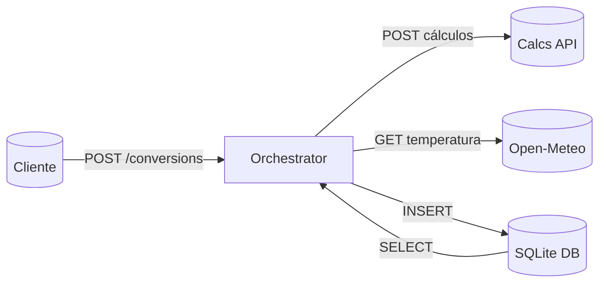

# EngLab Orchestrator API

Microserviço principal responsável por **orquestrar cálculos**, integrar dados de clima em tempo real e persistir o histórico das operações.  
Demonstra arquitetura baseada em componentes desacoplados e comunicação entre microsserviços.

---

## 📌 Arquitetura

A Orchestrator API implementa:

- Comunicação direta com a **EngLab Calcs API**
- Consumo da **API externa Open-Meteo**
- Persistência com **SQLite**
- CRUD completo
- Validação via Pydantic
- Projeto modular e escalável 

---

## 🧩 Fluxo da Orquestração

1. Cliente envia requisição para `/conversions`  
2. Payload é validado  
3. Orchestrator chama a **Calcs API**  
4. API externa Open-Meteo fornece temperatura atual  
5. Dados são agregados  
6. Registro é salvo no SQLite  
7. Resposta completa é retornada ao cliente  

---

## 📁 Estrutura de diretórios

```
MVP-englab-orchestrator-api/
├── app/
│   ├── main.py
│   ├── db.py
│   ├── models.py
│   ├── schemas.py
│   ├── routers/
│   │   ├── __init__.py
│   │   ├── conversions.py
│   │   └── health.py
│   └── __init__.py
├── .dockerignore
├── .gitattributes
├── .gitignore
├── Dockerfile
├── README.md
└── requirements.txt
```

---

## 🚀 Como rodar localmente (sem Docker)

> Testado com **Python 3.11**.  
> A Calcs API deve estar rodando em **http://127.0.0.1:8000**

### 1️⃣ Criar ambiente virtual

```bash
python -m venv venv
.venv\Scripts\activate
```

### 2️⃣ Instalar dependências

```bash
pip install -r requirements.txt
```

### 3️⃣ Executar servidor

```bash
uvicorn app.main:app --reload --port 8001
```

Swagger UI:  
👉 http://127.0.0.1:8001/docs

---

## 📡 Subindo a Calcs API (obrigatório)

A Orchestrator depende da Calcs API.

### Via Uvicorn:

```bash
uvicorn app.main:app --reload --port 8000
```

### Ou via Docker:

```bash
docker run --rm -p 8000:8000 englab-calcs-api
```

---

## 🐳 Docker — Orchestrator API

### Build

```bash
docker build -t englab-orchestrator-api .
```

### Run (apontando para a Calcs API local)

Windows / Mac / Linux:

```bash
docker run --rm -p 8001:8001   -e CALCS_API_URL=http://host.docker.internal:8000   englab-orchestrator-api
```

---

## 🧪 Endpoints principais

- `POST /conversions`  
- `GET /conversions`  
- `GET /conversions/{id}`  
- `PUT /conversions/{id}`  
- `DELETE /conversions/{id}`  

---

## 🌤️ API Externa

Usa a **Open-Meteo** para obter temperatura atual do Rio de Janeiro, sem necessidade de chave.

---

## 🔷 Diagrama da Arquitetura



---

## 🎯 Objetivo acadêmico

Demonstrar:
- Arquitetura de microsserviços  
- Integração entre serviços independentes  
- Consumo de API externa  
- Persistência e CRUD  
- Organização modular e clara  
